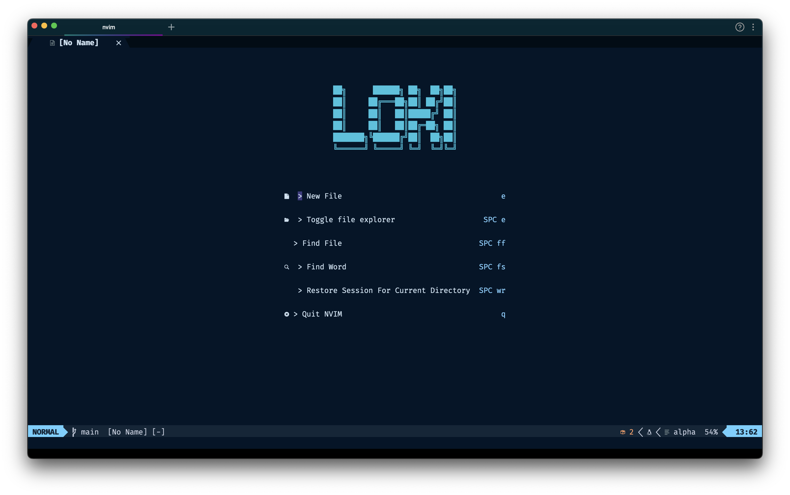
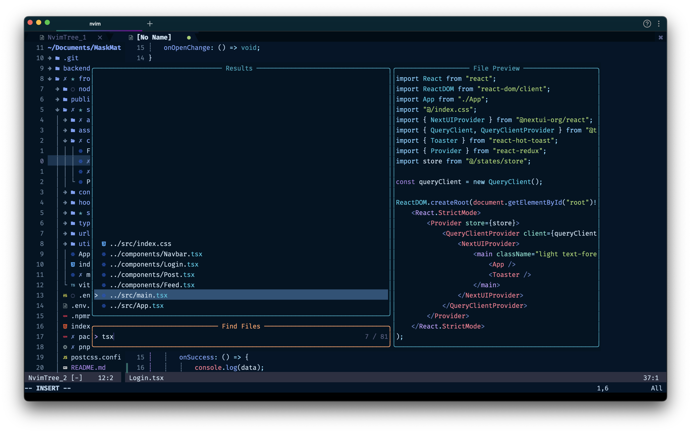
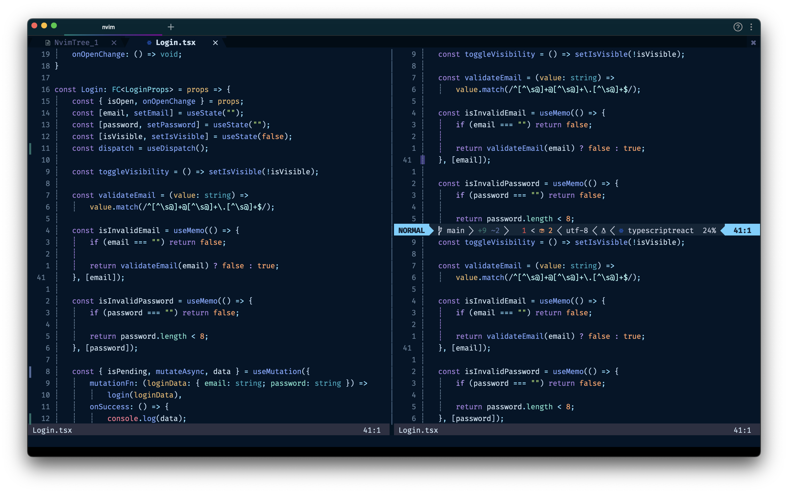

Hi, this is my neovim configuration for web developement🧑‍💻

<details>
<summary>Screenshots:</summary>



</details>

## Prequisites:

1. Homebrew
    ```shell
    /bin/bash -c "$(curl -fsSL https://raw.githubusercontent.com/Homebrew/install/HEAD/install.sh)"
    echo 'eval "$(/opt/homebrew/bin/brew shellenv)"' >> ~/.zprofile
    eval "$(/opt/homebrew/bin/brew shellenv)"
    ```
2. Iterm2
    ```shell
    brew install --cask iterm2
    ```
3. Neovim
    ```shell
    brew install neovim
    ```
4. Nerd Font
    ```shell
    brew tap homebrew/cask-fonts
    brew install font-meslo-lg-nerd-font
    ```
5. Ripgrep
    ```shell
    brew install ripgrep
    ```
6. Node
    ```shell
    brew install node
    ```

## Installation

1. Clone this repo to `~/.config/nvim`
    ```shell
    git clone https://github.com/lokeswaran-aj/neovim ~/.config/nvim
    ```
